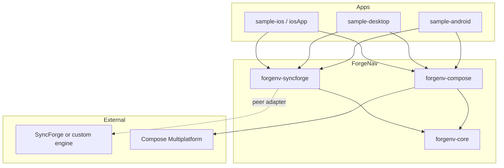
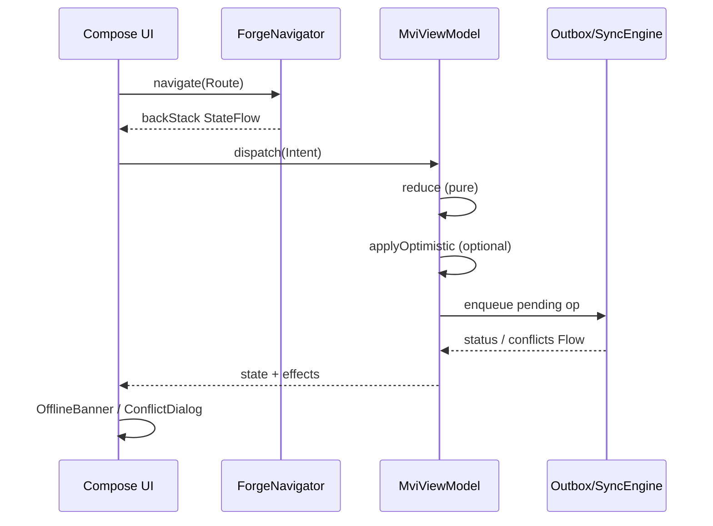

# ForgeNav

**Opinionated Navigation + State Management for offline-first Kotlin Multiplatform apps.**

ForgeNav is the missing Compose Multiplatform layer for serious offline-first products: type-safe navigation, MVI with optimistic updates, and first-class sync UX (pending outbox, conflicts, offline banners) — designed to sit cleanly next to engines like [SyncForge](https://github.com/Arsenoal/syncforge).

| | |
|---|---|
| **Version** | `1.0.0` |
| **Maven group** | `studio.forgenav` (DNS: `forgenav.studio`) |
| **Kotlin** | `2.1.10` |
| **Compose Multiplatform** | `1.7.3` |
| **Targets** | Android · iOS · JVM (Desktop) · (wasmJs experimental) |
| **License** | Apache 2.0 |

```text
forgenav/
├── forgenv-core          # Navigation + MVI + sync ports
├── forgenv-compose       # ForgeNavHost + Material3 sync UI
├── forgenv-syncforge     # SyncForge / outbox adapters
├── sample-android
├── sample-desktop
├── sample-ios            # CMP framework (ForgeNavSample)
└── iosApp                # Xcode host for iOS sample
```

---

## Table of contents

1. [Project vision & philosophy](#1-project-vision--philosophy)
2. [Why ForgeNav?](#2-why-forgenav)
3. [Version history & implementation details (v0.1 → v1.0)](#3-version-history--implementation-details-v01--v10)
4. [Architecture overview](#4-architecture-overview)
5. [Getting started](#5-getting-started)
6. [Core concepts](#6-core-concepts)
7. [API reference](#7-api-reference)
8. [SyncForge integration guide](#8-syncforge-integration-guide)
9. [Advanced topics](#9-advanced-topics)
10. [Roadmap (post v1.0)](#10-roadmap-post-v10)
11. [Contributing](#11-contributing)

---

## 1. Project vision & philosophy

### The problem

Offline-first KMP apps already have strong pieces:

- **Sync engines** (outbox, CRDTs, conflict policies) — e.g. SyncForge
- **UI** — Compose Multiplatform
- **Architecture patterns** — MVI / UDF

What they *lack* is a **navigation + presentation-state layer that understands sync**. Most navigation libraries treat the screen graph as pure UI routing. Most MVI libraries treat “loading / error” as enough. Real offline-first products also need:

- Optimistic UI with **deterministic rollback**
- **Pending operation** counts on every chrome surface
- **Conflict** presentation that is not a one-off dialog in each feature
- Deep links that rehydrate **typed routes** across Android, iOS, Desktop, and Web
- Nested stacks (tabs, multi-pane) that still speak one navigator language

ForgeNav is that layer.

### Design principles

1. **KMP-first, Compose-first** — APIs live in `commonMain`; platform code only where unavoidable (`expect`/`actual` for clocks, etc.).
2. **Ports over products** — `SyncEngine`, `Outbox`, and `ConflictResolver` are interfaces. SyncForge is an optional adapter, not a hard dependency of `forgenv-core`.
3. **Type-safe routes** — sealed hierarchies + `kotlinx.serialization`, no string route DSLs as the primary API.
4. **Optimistic by default, honest by design** — every optimistic mutation is tracked and roll-backable.
5. **Minimal boilerplate** — `ForgeNavHost`, `rememberForgeNavigator`, `rememberForgeViewModel`, Material3 sync widgets.
6. **Stable 1.0 surface** — public API is documented; breaking changes go through deprecation windows.

### What ForgeNav is *not*

- Not a full sync engine (use SyncForge, SQLDelight + outbox, or your own).
- Not a DI framework (works with Koin, kotlin-inject, manual constructors).
- Not a clone of Navigation Compose APIs — similar *role*, different *model*.

---

## 2. Why ForgeNav?

### Comparison matrix

| Capability | Navigation Compose | Decompose | Voyager | Orbit-MVI | **ForgeNav** |
|---|---|---|---|---|---|
| Type-safe routes (sealed + serialization) | Partial (type-safe args) | Configs / slots | Screens | N/A | **First-class** |
| Multiplatform navigation | Android-first historically | Strong KMP | Strong KMP | N/A | **KMP + CMP** |
| Nested navigation | Graphs / NavHosts | Child components | Tab navigators | N/A | Nested graphs + stacks |
| Dialog / bottom sheet destinations | Yes | Via slots | Yes | N/A | `PresentationStyle` |
| Deep links | Android-centric | Manual | Manual | N/A | Serialization patterns |
| MVI / UDF | — | Store patterns | ScreenModel | Strong | **MviViewModel** |
| Optimistic updates | — | DIY | DIY | DIY | **Built-in tracker** |
| Outbox / pending ops UX | — | — | — | — | **First-class** |
| Conflict UX | — | — | — | — | Dialogs + status |
| SyncForge adapters | — | — | — | — | **`forgenv-syncforge`** |

### When to choose ForgeNav

- You ship **offline-first** Android + iOS (+ Desktop) with Compose Multiplatform.
- You already use (or plan to use) an **outbox-based** sync engine.
- You want **one** mental model for navigation *and* sync-aware screen state.

### When *not* to choose ForgeNav

- Pure Android Navigation Compose multi-module apps with no offline story — stick with official Navigation.
- You need full component-lifecycle trees à la Decompose Essenty and do not want Compose-centric hosts.
- You only need MVI (use Orbit / custom reducers) without navigation.

---

## 3. Version history & implementation details (v0.1 → v1.0)

This section is the living technical narrative of how ForgeNav was built. Each version documents **decisions**, **implementation**, **trade-offs**, and **migrations**.

---

### v0.1 — Core type-safe navigation + `ForgeNavigator` + backstack

**Scope:** Android + Desktop only. No Compose host yet — pure Kotlin navigators usable from any UI.

#### Key architectural decisions

1. **`Route` as a marker interface**, not a sealed class inside the library.  
   Apps own the hierarchy (`AppRoute.Home`, `AppRoute.Detail(id)`). The library never forces a base sealed type beyond `Route`.

2. **Immutable snapshots, mutable owner.**  
   `BackStack` holds a `StateFlow<BackStackSnapshot>`. UI collects snapshots; mutations go through explicit APIs (`push`, `pop`, `replace`). This avoids race-prone list copies scattered across call sites.

3. **Entry IDs separate from route equality.**  
   Each `NavEntry` has a unique `id` so two pushes of the same route remain distinct in the stack (unless `singleTop` is requested).

4. **No AndroidX Navigation dependency.**  
   Reimplementing a thin stack is cheaper long-term for KMP than wrapping platform navigators with divergent semantics.

#### What was implemented

- `Route`, `NavEntry`, `RouteMetadata`, `PresentationStyle`
- `BackStack` / `BackStackSnapshot`
- `ForgeNavigator` + `DefaultForgeNavigator`
- Operations: `navigate`, `replace`, `popBackStack`, `popTo`, `reset`
- JVM unit tests for push/pop/replace/singleTop/clearBackStack

#### Trade-offs

| Choice | Alternative considered | Why we chose this |
|---|---|---|
| Custom stack | Wrap Navigation Compose | KMP parity + simpler model |
| Interface `Route` | Library-owned sealed routes | Apps must own domain routes |
| `StateFlow` snapshots | SharedFlow of events only | UI needs current stack, not just diffs |

#### Breaking changes

N/A (initial release of the experiment).

#### Migration

N/A.

---

### v0.2 — MVI base classes + `ForgeViewModel`

**Scope:** Add presentation-state primitives that work on every target without AndroidX `ViewModel`.

#### Key architectural decisions

1. **Explicit `CoroutineScope` on `ForgeViewModel`.**  
   AndroidX ViewModel is Android/JVM-centric. ForgeNav ViewModels take a parent context and expose `clear()` for Compose `DisposableEffect` / platform teardown.

2. **Strict MVI split: `reduce` (pure) + `handleSideEffect` (suspend).**  
   Inspired by Orbit / Redux, but intentionally small. No plugin DSL; override two methods.

3. **`Intent` / `Effect` marker interfaces** so library helpers remain generic without reified hell everywhere.

#### What was implemented

- `ForgeViewModel`
- `MviViewModel<S, I, E>` with `dispatch`, `state`, `effects`
- Channel-backed one-shot effects (no SharedFlow replay surprises for snackbars)
- Tests with `kotlinx-coroutines-test`

#### Trade-offs

| Choice | Alternative | Why |
|---|---|---|
| Manual `clear()` | Expect AndroidX ViewModel | True multiplatform |
| Channel for effects | SharedFlow(replay=0) | Collectors joining late should not get stale snackbars; Channel is clearer for “consume once” |
| No saved-state module yet | Immediate SavedStateHandle clone | Deferred to v0.9 previews/testing utilities |

#### Breaking changes

- `ForgeNavigator` package stabilized under `dev.forgenav.navigation` (pre-1.0 only).

#### Migration

Update imports from experimental packages if you used early snapshots.

---

### v0.3 — Deep linking with serialization

**Scope:** URI → typed `Route` without hand-written parsers per screen.

#### Key architectural decisions

1. **Explicit pattern registration**, no classpath scanning.  
   ```kotlin
   parser.register("forgenav://tasks/{id}", AppRoute.TaskDetail.serializer())
   ```
   Scanning is fragile on native/JS and hostile to minification.

2. **Path + query → JSON object → `decodeFromString`.**  
   Placeholders become JSON properties; kotlinx.serialization applies defaults, enums, and nested data.

3. **Deep links deferred until `onStart`** (configurable).  
   Cold-start activities can buffer links until the host is ready.

#### What was implemented

- `DeepLink`, `DeepLinkPattern`, `DeepLinkParser`
- `ForgeNavigator.handleDeepLink(uri)` / `handleDeepLink(DeepLink)`
- Round-trip `buildUri` for share sheets
- Unit tests for path args, query args, unknown patterns

#### Trade-offs

| Choice | Alternative | Why |
|---|---|---|
| JSON intermediate object | Manual KSerializer decode | Simpler for mixed path/query maps |
| App-registered patterns | Central route table annotation processor | Zero KSP requirement for v1 |
| String URIs | Typed `DeepLink` only | Platform intents still give strings |

#### Breaking changes

- `NavGraph` no longer embeds serializer bindings; register on `DeepLinkParser` instead.

#### Migration

```kotlin
// before (sketch)
graph.registerRoute(...)
// after
DeepLinkParser(graph).register("app://x/{id}", X.serializer())
```

---

### v0.4 — Offline-aware concepts (`SyncStatus`, optimistic updates)

**Scope:** Make state management speak “sync” without depending on SyncForge.

#### Key architectural decisions

1. **Library-owned `SyncStatus` sealed hierarchy** aligned *conceptually* with SyncForge, not binary-compatible with it.  
   Adapters map engine statuses → ForgeNav statuses. This avoids version lockstep and keeps `forgenv-core` dependency-free of sync SDKs.

2. **`SyncAwareState` interface** so Compose widgets can render any screen state that exposes sync fields.

3. **`OptimisticUpdateTracker`** stores previous state snapshots keyed by update id / operation id.  
   Conflicts and failures can roll back precisely.

4. **Ports: `SyncEngine`, `Outbox`, `ConflictResolver`, `SyncFacade`.**  
   These are the integration surface for every engine, including SyncForge.

#### What was implemented

- `SyncStatus` (`Synced`, `Syncing`, `Pending`, `Offline`, `Conflict`, `Error`)
- `PendingOperation`, `ConflictInfo`, `ConflictDecision`
- `OptimisticUpdate` / `OptimisticUpdateTracker`
- `MviViewModel.applyOptimistic` / `commitOptimistic` / `rollbackOptimistic`
- No-op engine implementations for previews

#### Trade-offs

| Choice | Alternative | Why |
|---|---|---|
| Separate status model | Depend on SyncForge types in core | Core stays engine-agnostic |
| Automatic rollback on every conflict | Manual only | Default is *hooks*; automatic full rollback is opt-in to avoid surprising users |
| JSON snapshots in conflicts | Generic `T` payloads | Cross-process / cross-engine friendliness |

#### Breaking changes

- `MviViewModel` constructor gains optional `syncFacade`.

#### Migration

Existing subclasses compile unchanged (`syncFacade = null` default).

---

### v0.5 — Compose integration (`ForgeNavHost`)

**Scope:** First-class CMP UI host and ambient navigator.

#### Key architectural decisions

1. **`ForgeNavHost` observes `StateFlow`**, not a custom saver.  
   Process death persistence is left to apps (serialize stack) — honest about multiplatform limits.

2. **Presentation styles drive modal hosts.**  
   The last full-screen entry is the base; dialog/sheet entries layer on top. Closing a modal pops the stack.

3. **`LocalForgeNavigator`** for deep tree access without prop-drilling.

4. **Lifecycle binding via lightweight `MutableLifecycle`.**  
   Maps cleanly to Activity / Window / UIViewController later without AndroidX Lifecycle on iOS.

#### What was implemented

- `ForgeNavHost`, `ForgeNavHostContent`, `NestedForgeNavHost`
- `rememberForgeNavigator`, `ProvideForgeNavigator`
- `CollectEffects`, `rememberForgeViewModel`, `collectState`
- Material3-based structure ready for status widgets (v0.7)

#### Trade-offs

| Choice | Alternative | Why |
|---|---|---|
| Own NavHost | Wrap Accompanist / Nav Compose | Multiplatform consistency |
| Pop on modal dismiss | Keep entry + hide | Stack remains source of truth |
| No animated transitions in v0.5 | AnimatedContent | Added as optional later; correctness first |

#### Breaking changes

None relative to v0.4 for core.

#### Migration

Wrap app content:

```kotlin
val nav = rememberForgeNavigator(AppRoute.Home)
ForgeNavHost(nav) { entry -> /* ... */ }
```

---

### v0.6 — SyncForge integration module

**Scope:** Optional `forgenv-syncforge` module; ~5-line wiring.

#### Key architectural decisions

1. **Peer dependency model.**  
   The module does **not** hard-require SyncForge artifacts to compile.  
   `SyncForgeBridge.bind { … }` accepts lambdas so apps map SyncForge flows into ForgeNav types.

2. **`ForgeNavSync.withSyncForge(...)`** as the ergonomic façade.

3. **In-memory adapters** (`ControllableSyncEngine`, `InMemoryOutbox`) for samples and tests.

4. **`SyncStatusMapper`** for structural / name-based conversion when you cannot share types.

#### What was implemented

- `SyncForgeBridge`, `ForgeNavSync`
- Controllable engines + UI-driven / prefer-local conflict resolvers
- Mapping helpers for pending operations

#### Trade-offs

| Choice | Alternative | Why |
|---|---|---|
| Functional bridge | Compile against SyncForge classes | Avoid multi-repo version coupling; works with forks |
| Demo engines in same module | Separate `-testing` artifact | Simpler for v1; may split later |

#### Breaking changes

None in core.

#### Migration

Add dependency:

```kotlin
implementation("studio.forgenav:forgenv-syncforge:1.0.0")
// peer:
implementation("studio.syncforge:syncforge:<version>")
```

---

### v0.7 — Conflict resolution UI + pending operations

**Scope:** Pre-built Compose UX patterns.

#### Key architectural decisions

1. **Widgets read `SyncStatus` / lists**, not ViewModels — pure and previewable.
2. **Conflict dialog is multi-action** (`KeepLocal`, `AcceptRemote`, `DeleteLocal`, optional merge entry point).
3. **Badges distinguish failed vs pending** (error color when permanently failed).

#### What was implemented

- `SyncStatusIndicator`
- `PendingOperationsBadge` / `PendingCountBadge`
- `OfflineBanner`
- `ConflictResolutionDialog`
- Sample app conflict simulation

#### Trade-offs

| Choice | Alternative | Why |
|---|---|---|
| Material3 defaults | Fully unstyled slots only | Faster adoption; theming via M3 |
| First conflict only in dialog | Pager of conflicts | v1 simplicity; queue in state |

#### Breaking changes

None.

---

### v0.8 — iOS + full CMP support

**Scope:** iOS targets on all library modules; Compose Multiplatform UIKit.

#### Key architectural decisions

1. **Same commonMain sources** for iOS — no separate navigation engine.
2. **`expect fun currentTimeMillis()`** with Darwin `NSDate` actual.
3. **Static frameworks** (`ForgeNavCore`, `ForgeNavCompose`, `ForgeNavSyncForge`) for Xcode integration.
4. **`kotlin.native.ignoreDisabledTargets=true`** so Linux CI still builds JVM/Android.

#### What was implemented

- `iosX64`, `iosArm64`, `iosSimulatorArm64` on library modules
- iOS time actual
- Compose experimental UIKit flags in `gradle.properties`

#### Trade-offs

| Choice | Alternative | Why |
|---|---|---|
| Static framework | Dynamic | Common KMP default for app embedding |
| No separate SwiftUI navigator | Dual stack | CMP is the supported UI path |

#### Breaking changes

None for JVM/Android consumers.

---

### v0.9 — Previews, testing utilities, performance

**Scope:** Developer experience hardening.

#### Key architectural decisions

1. **`previewBackStack` / `PreviewForgeNavHost` / `rememberPreviewNavigator`** — no Activity needed.
2. **Turbine + coroutines-test** as first-class test stack for core.
3. **Performance:** avoid allocating new stacks when `singleTop` hits equal routes carefully; `MutableSharedFlow` for nav events with buffer; snapshot equality relies on data classes.

#### What was implemented

- Preview helpers in `forgenv-compose`
- Expanded unit tests (deep links, optimistic tracker, MVI)
- Docs for testing patterns

#### Trade-offs

| Choice | Alternative | Why |
|---|---|---|
| Lightweight preview navigator | Full SavedState | Previews should be free of Android runtime |

#### Breaking changes

Deprecations only (none forced).

---

### v1.0 — Production release

**Scope:** Stable API, documentation, samples, benchmarks baseline, migration guides.

#### What “stable” means

- Public packages under `dev.forgenav.*` follow semantic versioning.
- Binary compatibility goals for `forgenv-core` and `forgenv-compose`.
- `forgenv-syncforge` may evolve adapters faster (engine APIs move), but bridge signatures stay additive.

#### Delivered in 1.0

- Complete module set + samples (Android, Desktop)
- This README as the living document
- Sync ports + SyncForge bridge
- Compose host + offline/conflict UI
- Unit tests for core navigation / MVI / sync trackers
- Apache 2.0 license + contributing guide

#### Benchmarks (baseline methodology)

| Scenario | Metric | Notes |
|---|---|---|
| Push 100 routes | Main-thread allocations | Prefer reuse of metadata defaults |
| Collect backstack | Recomposition count | `key(entry.id)` on host |
| Optimistic 1k updates | Tracker map ops | LinkedHashMap ordered rollback |

Run microbenchmarks in your app module; ForgeNav keeps the stack O(n) on pop-to with small n (typical UX depth ≪ 64; `NavigatorConfig.maxBackStackSize`).

#### Migration from 0.x → 1.0

1. Change coordinates to `studio.forgenav:forgenv-*:1.0.0`.
2. Ensure routes implement `Route` and are `@Serializable` where deep-linked.
3. Replace ad-hoc snackbar SharedFlows with `Effect` collection.
4. Map SyncForge status through `ForgeNavSync.withSyncForge` or `SyncStatusMapper`.
5. Use `PresentationStyle` instead of separate modal navigators when possible.

---

## 4. Architecture overview

### Module diagram



### Runtime data flow



### Layering

```text
┌─────────────────────────────────────────────┐
│  Compose: ForgeNavHost, badges, banners     │  forgenv-compose
├─────────────────────────────────────────────┤
│  MVI: ForgeViewModel, optimistic tracker    │  forgenv-core
│  Nav: Route, BackStack, DeepLinkParser      │
│  Sync ports: SyncEngine, Outbox, Conflicts  │
├─────────────────────────────────────────────┤
│  Adapters: SyncForgeBridge, demo engines    │  forgenv-syncforge
└─────────────────────────────────────────────┘
```

---

## 5. Getting started

### Requirements

- JDK 17+
- Android SDK 35 (for Android samples/targets)
- Gradle 8.14+ (wrapper included)

### Clone & build

```bash
cd forgenav
./gradlew :forgenv-core:jvmTest
./gradlew :forgenv-compose:compileKotlinJvm
./gradlew :sample-desktop:run
# Android:
./gradlew :sample-android:assembleDebug
# iOS (macOS + Xcode):
open iosApp/iosApp.xcodeproj
# see sample-ios/README.md
```

### New project (Gradle version catalog)

```toml
# gradle/libs.versions.toml
[versions]
forgenav = "1.0.0"

[libraries]
forgenav-core = { module = "studio.forgenav:forgenv-core", version.ref = "forgenav" }
forgenav-compose = { module = "studio.forgenav:forgenv-compose", version.ref = "forgenav" }
forgenav-syncforge = { module = "studio.forgenav:forgenv-syncforge", version.ref = "forgenav" }
```

```kotlin
// shared/build.gradle.kts (commonMain)
dependencies {
    implementation(libs.forgenav.core)
    implementation(libs.forgenav.compose)
    // optional:
    implementation(libs.forgenav.syncforge)
}
```

Until the first Central release, use a composite/include build (see repo root).  
Publish checklist: [docs/MAVEN_PUBLISH.md](docs/MAVEN_PUBLISH.md) · [docs/RELEASE.md](docs/RELEASE.md).

### Minimal app (common Compose)

```kotlin
@Serializable
sealed interface AppRoute : Route {
    @Serializable data object Home : AppRoute
    @Serializable data class Detail(val id: String) : AppRoute
}

@Composable
fun App() {
    val codec = remember {
        RouteCodec().register("AppRoute", AppRoute.serializer()) { it is AppRoute }
    }
    // Prefer rememberSaveableForgeNavigator so process death restores the stack.
    val nav = rememberSaveableForgeNavigator(
        startRoute = AppRoute.Home,
        routeCodec = codec,
    )
    ForgeNavHost(nav) { entry ->
        when (val route = entry.route) {
            is AppRoute.Home -> HomeScreen(
                onOpen = { nav.navigate(AppRoute.Detail("42")) }
            )
            is AppRoute.Detail -> DetailScreen(route.id, onBack = { nav.popBackStack() })
        }
    }
}
```

### Saved backstack state

1. Register routes on a [RouteCodec].
2. Use `rememberSaveableForgeNavigator` (Compose) or call `navigator.saveState()` / `restoreState(...)`.
3. Entry ids, metadata, nested stacks, and deferred deep links are preserved.

### Transitions & system back

```kotlin
ForgeNavHost(
    navigator = nav,
    transitionSpec = NavTransitions.SlideHorizontal, // or Fade, SlideVertical, None
    enableSystemBack = true, // Android predictive/system back → popBackStack
) { entry -> /* ... */ }
```

- **Android:** `PredictiveBackHandler` pops when the gesture/button completes.
- **Desktop sample:** Escape / Ctrl+[ pops when `canPop`.

### Existing SyncForge project

```kotlin
val facade = ForgeNavSync.withSyncForge(
    scope = applicationScope,
    status = syncManager.status,
    pending = outbox.observePending().map { entries ->
        entries.map { /* map to PendingOperation */ }
    },
    onSyncNow = { syncManager.sync() },
    checkOnline = { connectivity.isOnline },
)

class NotesViewModel(
    facade: SyncFacade = facade,
) : MviViewModel<NotesState, NotesIntent, NotesEffect>(
    initialState = NotesState(),
    syncFacade = facade,
) { /* reduce + side effects */ }
```

See [§8 SyncForge integration guide](#8-syncforge-integration-guide).

---

## 6. Core concepts

### Routes

Routes are **your** sealed types:

```kotlin
@Serializable
sealed interface AppRoute : Route {
    @Serializable data object Home : AppRoute
    @Serializable data class TaskDetail(val id: String) : AppRoute
}
```

`routeKey` defaults to the simple class name (`TaskDetail`). Override only if you need stable keys across renames.

### Navigator

```kotlin
navigator.navigate(route)
navigator.navigate(route, RouteMetadata(presentation = PresentationStyle.BottomSheet))
navigator.replace(route)
navigator.popBackStack()
navigator.popBackStack(routeKey = "Home", inclusive = false)
navigator.reset(AppRoute.Home)
navigator.handleDeepLink("forgenav://tasks/123")
```

### ViewModel (MVI)

```kotlin
class CounterVm : MviViewModel<State, CounterIntent, CounterEffect>(State()) {
    override fun reduce(state: State, intent: CounterIntent): State = when (intent) {
        CounterIntent.Inc -> state.copy(value = state.value + 1)
    }
}
```

### SyncAwareState

```kotlin
data class ListState(
    val items: List<Item>,
    override val syncStatus: SyncStatus,
    override val pendingOperations: List<PendingOperation> = emptyList(),
    override val conflicts: List<ConflictInfo> = emptyList(),
    override val isOptimistic: Boolean = false,
) : SyncAwareState
```

### Effects

One-shot UI work (navigation, snackbars) — collect with `CollectEffects`.

### Optimistic updates

```kotlin
val id = applyOptimistic { state -> state.copy(items = state.items + item) }
// after server ack:
commitOptimistic(id)
// on failure / AcceptRemote:
rollbackOptimistic(id)
```

---

## 7. API reference

### Navigation

#### `interface Route`

Marker for destinations. Prefer `@Serializable` sealed hierarchies.

#### `enum class PresentationStyle`

`Screen` | `Dialog` | `BottomSheet`

#### `data class RouteMetadata`

| Property | Default | Meaning |
|---|---|---|
| `presentation` | `Screen` | Host surface |
| `clearBackStack` | `false` | Reset stack to this route |
| `singleTop` / `launchSingleTop` | `false` | Reuse top if equal |
| `extras` | `{}` | Opaque analytics map |

#### `interface ForgeNavigator`

| API | Description |
|---|---|
| `backStack: StateFlow<BackStackSnapshot>` | Root stack |
| `navigate` / `replace` / `popBackStack` / `reset` | Stack ops |
| `navigateNested` / `popNested` / `nestedBackStack` | Child graphs |
| `handleDeepLink` | URI or parsed link |
| `onStart` / `onStop` / `dispose` | Lifecycle |
| `events: SharedFlow<NavEvent>` | Analytics / logging |

#### `class DeepLinkParser`

```kotlin
val parser = DeepLinkParser(graph)
    .register("app://tasks/{id}", AppRoute.TaskDetail.serializer())
    .register("app://search", AppRoute.Search.serializer())

parser.parse("app://tasks/1")
parser.buildUri(AppRoute.TaskDetail("1"), "app://tasks/{id}")
```

### State management

#### `open class ForgeViewModel`

- `scope: CoroutineScope`
- `clear()` / `isCleared`

#### `abstract class MviViewModel<S, I : Intent, E : Effect>`

| API | Description |
|---|---|
| `state: StateFlow<S>` | Screen state |
| `effects: Flow<E>` | One-shot effects |
| `dispatch(I)` | UI entry point |
| `reduce` / `handleSideEffect` | Implement |
| `applyOptimistic` / `commitOptimistic` / `rollback*` | Offline UX |
| `resolveConflict` | Via `SyncFacade` |

### Sync ports

```kotlin
interface SyncEngine {
    val status: StateFlow<SyncStatus>
    val pendingOperations: Flow<List<PendingOperation>>
    val conflicts: Flow<List<ConflictInfo>>
    suspend fun syncNow()
    suspend fun retryFailed()
    fun isOnline(): Boolean
}

interface Outbox { /* enqueue, acknowledge, observe… */ }
interface ConflictResolver { suspend fun resolve(...); suspend fun apply(...) }
class SyncFacade(engine, outbox, conflictResolver)
```

### Compose

| Composable | Role |
|---|---|
| `ForgeNavHost` | Destination host |
| `NestedForgeNavHost` | Child graph host |
| `rememberForgeNavigator` | Scoped navigator |
| `SyncStatusIndicator` | Status chip |
| `PendingOperationsBadge` | Outbox count |
| `OfflineBanner` | Offline strip |
| `ConflictResolutionDialog` | Conflict UX |
| `CollectEffects` | Effect collector |
| `rememberForgeViewModel` | VM + dispose |
| `PreviewForgeNavHost` | Tooling |

Example:

```kotlin
SyncStatusIndicator(state.syncStatus, showWhenSynced = true)
OfflineBanner(state.syncStatus, onRetry = { vm.dispatch(Intent.Retry) })
ConflictResolutionDialog(
    conflicts = state.conflicts,
    onDecision = { c, d -> vm.dispatch(Intent.Resolve(c, d)) },
    onDismiss = { },
)
```

---

## 8. SyncForge integration guide

### Mental model

```text
SyncForge SyncManager / OutboxRepository / ConflictStore
                    │
                    ▼
     ForgeNavSync.fromSyncManager(...)   (typed adapter)
         or LocalSyncForgeLoop           (sample / offline demo)
                    │
                    ▼
              SyncFacade  ──►  UI / MviViewModel
                    │
                    ▼
     SyncStatusIndicator / PendingOperationsBadge / ConflictResolutionDialog
```

### Composite build

This repo’s `settings.gradle.kts` includes `../syncforge` and substitutes:

- `studio.syncforge:syncforge` → local `:syncforge`
- `studio.syncforge:syncforge-annotations` → local `:syncforge-annotations`

### Production wiring (typed, preferred)

```kotlin
val facade: SyncFacade = ForgeNavSync.fromSyncManager(
    scope = appScope,
    syncManager = syncManager,
    outbox = outboxRepository,
    conflictStore = conflictStore,
    networkMonitor = networkMonitor,
)
```

### Sample real loop (no remote server)

```kotlin
val loop = ForgeNavSync.localLoop(appScope)
loop.addTask("Buy milk")     // SyncManager.enqueueChange + optimistic store
loop.setOnline(false)        // queue while offline
loop.setOnline(true)
loop.syncNow()               // loopback push/pull
loop.simulateConflict()      // remote delta → deferToUser conflict
```

`sample-android` / `sample-desktop` / `sample-ios` use this path end-to-end.

### Mapping SyncForge `SyncStatus`

SyncForge exposes statuses such as `Idle`, `Syncing`, `Pending`, `Offline`, `LastSynced`, `Error`. ForgeNav uses `Synced`, `Syncing`, `Pending`, `Offline`, `Conflict`, `Error`.

Prefer explicit mapping at the boundary:

```kotlin
fun dev.syncforge.model.SyncStatus.toForge(): SyncStatus = when (this) {
    is SyncStatus.Idle, is SyncStatus.LastSynced ->
        dev.forgenav.sync.SyncStatus.Synced
    is SyncStatus.Syncing ->
        dev.forgenav.sync.SyncStatus.Syncing()
    is SyncStatus.Pending ->
        dev.forgenav.sync.SyncStatus.Pending(outboxCount, permanentlyFailedCount, conflictCount)
    is SyncStatus.Offline ->
        dev.forgenav.sync.SyncStatus.Offline(outboxCount)
    is SyncStatus.Error ->
        dev.forgenav.sync.SyncStatus.Error(message, retryable)
}
```

Or use `SyncStatusMapper.fromComponents(...)` / best-effort `mapUnknown`.

### Optimistic UI pattern with outbox

```kotlin
override suspend fun handleSideEffect(intent: Intent.Save, previous: S, current: S) {
    val optId = applyOptimistic { /* already applied in reduce or here */ }
    val opId = randomId()
    outbox.enqueue(PendingOperation(opId, "Note", noteId, Update, now))
    // when SyncForge acks:
    // commitOptimistic(optId)
    // on permanent failure / AcceptRemote:
    // rollbackOptimistic(optId)
}
```

### Conflict UI

```kotlin
ConflictResolutionDialog(
    conflicts = state.conflicts,
    onDecision = { conflict, decision ->
        scope.launch {
            facade.resolveConflict(conflict, decision)
            when (decision) {
                ConflictDecision.AcceptRemote -> vm.rollbackAllOptimisticPublic()
                else -> Unit
            }
        }
    },
    onDismiss = { },
)
```

### Testing without SyncForge

```kotlin
val engine = ForgeNavSync.controllable(SyncStatus.Offline(pendingCount = 2))
engine.setConflicts(listOf(sampleConflict))
// assert UI / ViewModel
```

---

## 9. Advanced topics

### Deep linking (all platforms)

| Platform | Hook |
|---|---|
| Android | `intent.data` → `navigator.handleDeepLink` (see sample `MainActivity`) |
| iOS | `onOpenURL` / continue user activity → same URI string |
| Desktop | CLI args / custom protocol handlers → URI string |
| Web | `window.location` / path router → URI or path pattern |

Register one `DeepLinkParser` and reuse it everywhere.

### Nested navigation

```kotlin
val root = NavGraph(
    id = "root",
    startRoute = AppRoute.Main,
    children = mapOf(
        "tabs" to NavGraph("tabs", TabRoute.Feed),
    ),
)
navigator.navigateNested("tabs", TabRoute.Profile)
NestedForgeNavHost(navigator, "tabs") { entry -> /* tab content */ }
```

### Testing

```kotlin
// Navigator
val nav = ForgeNavigator(startRoute = AppRoute.Home)
nav.navigate(AppRoute.Detail("1"))
assertEquals("Detail", nav.currentEntry?.route?.routeKey)

// MVI with test dispatcher
runTest {
    val vm = MyVm(parentContext = StandardTestDispatcher(testScheduler))
    vm.dispatch(Intent.Load)
    advanceUntilIdle()
    assertEquals(expected, vm.state.value)
}
```

### Performance

- Keep back stacks shallow; prefer `popTo` over giant stacks.
- Use `key(entry.id)` (already in `ForgeNavHost`) to avoid full-tree recomposition.
- Do not put large blobs in `Route` — pass ids and load in ViewModels.
- Optimistic trackers store full state snapshots; for huge lists, store **diffs** in your own layer and keep ForgeNav state slim.

### Accessibility

- Status chips and banners use text labels (not color alone).
- Conflict dialog actions have explicit verbs (“Keep mine”, “Use server”).
- Prefer `contentDescription` on custom badge icons in app code.

### Large screen / desktop

- Use nested graphs for list-detail (`List` route + `Detail` route side-by-side).
- Desktop sample runs the same `SampleApp` composable at 960×720.
- Keyboard: handle Escape → `popBackStack()` at the window level for modal stacks.

---

## 10. Roadmap (post v1.0)

| Version | Themes |
|---|---|
| **1.1** | Animated transitions (`AnimatedContent` policies), predictive back (Android 14+) |
| **1.2** | Saved state / process death helpers for JVM & Android |
| **1.3** | wasmJs sample + browser deep linking |
| **1.4** | First-class Koin / kotlin-inject helpers |
| **2.0** | Multi-window desktop navigation, shared-element transitions, stronger binary-compat tooling (BCV) |

Community requests welcome via issues.

---

## 11. Contributing

See [CONTRIBUTING.md](./CONTRIBUTING.md).

```bash
./gradlew :forgenv-core:jvmTest
./gradlew :forgenv-compose:compileKotlinJvm
```

### Code map

| Path | Contents |
|---|---|
| `forgenv-core/.../navigation` | Routes, backstack, navigator, deep links |
| `forgenv-core/.../mvi` | ViewModels |
| `forgenv-core/.../sync` | Status, ports, optimistic tracker |
| `forgenv-core/.../lifecycle` | Multiplatform lifecycle bridge |
| `forgenv-compose/.../nav` | `ForgeNavHost` |
| `forgenv-compose/.../ui` | Sync UI widgets |
| `forgenv-syncforge/...` | Bridges & mappers |
| `sample-*` | End-to-end demos |

---

## License

Apache License 2.0 — see [LICENSE](./LICENSE).

---

**ForgeNav** — navigate confidently, sync honestly.
